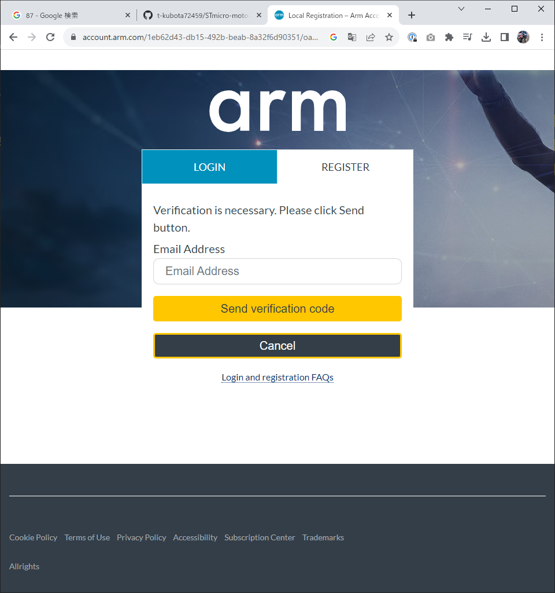
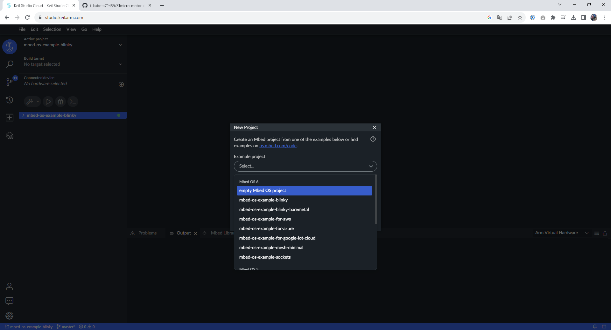

# Keil Studio をセットアップする

メールアドレスを登録すると、検証用コードが送られてきます。その検証用コードを登録すると利用できるようになります。

- Keil Studio
  - https://studio.keil.arm.com/

- First name なまえ
- Last name 名字
- Job Role 職業
  - Researcher/Academic/Student/Education
- Target Markets 主なマーケット
- Country 国
- Street Address 学校の住所
- City 市
  - Hiroshima
- New Password / Confirm New Password パスワード
- メールを受け取るかどうか

# 新しいプロジェクトをつくる

File -> New -> Mbed Project  
いくつかテンプレートがあり、利用するタイプを選ぶ。

